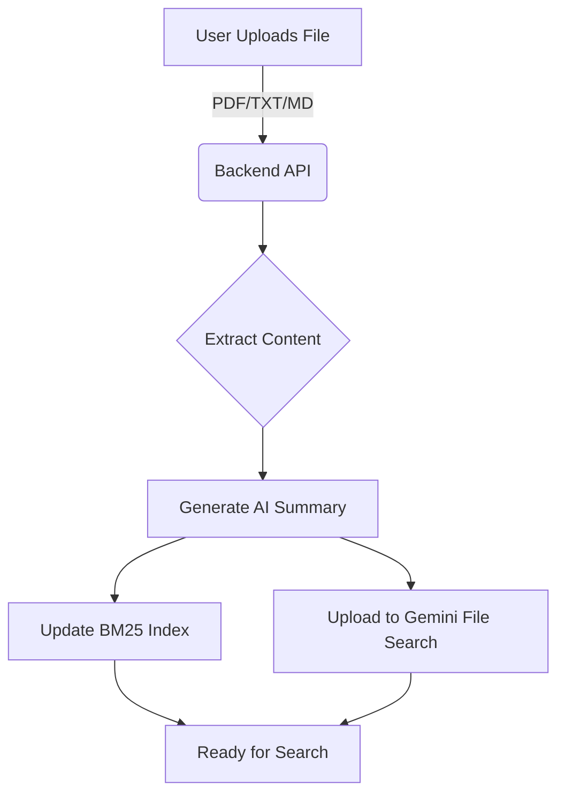

# Search & Indexing System Documentation

This document consolidates the technical details, architecture, and API reference for the Hybrid Search and Semantic Indexing pipeline in GeminiRAG.

## 1. Overview

GeminiRAG implements a **Hybrid Search** system that combines:
1.  **BM25 (Keyword Search)**: Exact term matching, good for specific technical terms.
2.  **Semantic Search (Gemini File Search)**: Meaning-based retrieval, good for context and synonyms.

The system automatically handles document processing, indexing, and retrieval using a weighted combination of these two methods.

## 2. Architecture

### File Upload & Indexing Pipeline

When a file is uploaded, it goes through the following process:



1.  **Extract Content**: Text is extracted from the uploaded file.
2.  **Generate Summary**: Gemini 2.0 Flash generates a concise summary.
3.  **BM25 Indexing**: Content is added to the local BM25 index.
4.  **Semantic Indexing**: Content is uploaded to a Gemini File Search store.

### Hybrid Search Logic

When a query is received:

1.  **BM25 Search**: Finds documents with exact keyword matches.
2.  **Semantic Search**: Uses Gemini File Search API to find semantically similar content.
3.  **Score Normalization**: Both scores are normalized to a 0-1 range.
4.  **Weighted Combination**: Scores are combined (default: 40% BM25 + 60% Semantic).
5.  **Re-ranking**: Results are re-ranked based on the combined score.

## 3. Configuration

To enable the full Hybrid Search capabilities, update your `.env` file:

```bash
# Enable semantic search component
SEMANTIC_SEARCH_ENABLED=true

# File Search store name (optional, defaults to GeminiRAG-Store)
FILE_SEARCH_STORE_NAME=GeminiRAG-Store

# Hybrid search weights (optional)
HYBRID_BM25_WEIGHT=0.4
HYBRID_SEMANTIC_WEIGHT=0.6
```

**Fallback Behavior:**
- If `SEMANTIC_SEARCH_ENABLED` is false or the API key is missing, the system gracefully falls back to **BM25-only** mode.

## 4. API Reference

### Document Management

#### Upload File
`POST /api/upload-file`
Uploads a file and automatically triggers both BM25 and Semantic indexing.

```bash
curl -X POST http://localhost:5001/api/upload-file \
  -F "file=@document.pdf"
```

#### Create Store
`POST /api/create-store`
Initializes the document store and Gemini File Search store.

```json
{
  "display_name": "My-Store"
}
```

### Search Endpoints

#### Hybrid Search (Single Document)
`POST /api/documents/search_hybrid`

```json
{
  "doc_id": "document_id",
  "question": "your query",
  "k": 5,
  "bm25_weight": 0.4,
  "semantic_weight": 0.6
}
```

#### Hybrid Search (All Documents)
`POST /api/documents/search_all_hybrid`

```json
{
  "question": "your query",
  "k": 5
}
```

## 5. Integration Guide

### Agent Integration
The Planner Agent is pre-configured to use hybrid search tools:
- `search_document_hybrid_http`: For questions about a specific document.
- `search_all_hybrid_http`: For broad questions across the knowledge base.

### Testing
You can run the tests to verify the search functionality:

```bash
# Hybrid search tests (no API key needed for BM25 parts)
python -m pytest tests/test_hybrid_search.py -v

# Semantic search tests (requires GOOGLE_API_KEY)
python -m pytest tests/test_semantic_search.py -v
```

## 6. Benefits

| Feature | BM25 Only | Hybrid Search |
|---------|-----------|---------------|
| **Matching Strategy** | Exact Keywords | Keywords + Context |
| **Synonym Handling** | Poor | Excellent |
| **Technical Terms** | Excellent | Good |
| **Setup** | Simple | Requires API Key |
