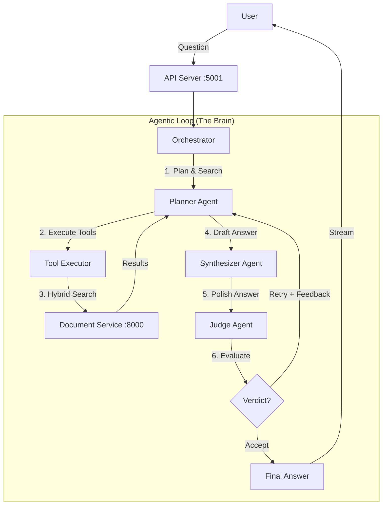

# 🏗️ System Design & Architecture

This document provides a detailed technical overview of the GeminiRAG Agentic system.

## 1. High-Level Architecture

GeminiRAG uses a **Multi-Agent Orchestration** pattern to ensure high-quality, grounded answers. Instead of a single LLM call, the system employs specialized agents (Planner, Judge, Synthesizer) that work together in a loop.



## 2. Core Components

### 🧠 Backend (`backend/`)

The backend is the intelligence center, built with Python and FastAPI.

*   **Orchestrator (`orchestrator.py`)**: The central control loop. It manages the state, passes messages between agents, and enforces the retry limit (default: 3 attempts).
*   **Planner Agent (`agents/planner.py`)**:
    *   **Role**: "Orion" - The Researcher.
    *   **Responsibility**: Analyzes the user's intent, breaks it down into search queries, and calls tools to retrieve evidence.
    *   **Tools**: `list_documents`, `search_document_hybrid`, `search_all_hybrid`.
*   **Judge Agent (`agents/judge.py`)**:
    *   **Role**: The Evaluator.
    *   **Responsibility**: strictly evaluates the Planner's draft answer against the retrieved evidence. It checks for hallucinations, missing information, and alignment with the user's intent.
    *   **Output**: A strict JSON verdict (`accept` or `retry`) with specific feedback.
*   **Synthesizer Agent (`agents/synthesizer.py`)**:
    *   **Role**: "Aurora" - The Writer.
    *   **Responsibility**: Takes the raw draft and evidence from the Planner and formats it into a clean, professional response (markdown, bullet points, etc.).

### 📚 Document Service (`services/`)

A dedicated microservice for managing knowledge.

*   **Hybrid Search Engine**: Combines two powerful search techniques:
    1.  **BM25 (Keyword)**: Good for exact matches (e.g., "Error 503").
    2.  **Semantic (Vector)**: Good for meaning (e.g., "Server unavailable").
    *   *Weighting*: Default is 40% BM25 + 60% Semantic.
*   **Google File Search**: Uses Gemini's native File Search API for state-of-the-art semantic retrieval.
*   **Persistence**: Automatically saves the BM25 index to disk (`documents/`) so data survives restarts.

### 🎨 Frontend (`react_frontend/`)

A modern, responsive UI built with vanilla HTML/CSS/JS (no heavy framework build steps required).

*   **Real-time Streaming**: Displays the answer token-by-token as it's generated.
*   **Thought Process**: Shows the user exactly what the agents are doing (e.g., "Searching for 'deployment guide'...", "Judge requested a retry...").

## 3. The Agentic Workflow (Step-by-Step)

1.  **User Asks**: "How do I deploy this app?"
2.  **Planner Starts**:
    *   Analyzes the question.
    *   Calls `search_all_hybrid(query="deployment guide")`.
3.  **Tool Execution**:
    *   Backend calls Document Service.
    *   Document Service runs BM25 + Semantic search and returns top 5 snippets.
4.  **Planner Drafts**:
    *   Reads snippets.
    *   Drafts an answer: "You can deploy using the start.sh script..."
5.  **Synthesizer Polishes**:
    *   Formats the draft into a nice markdown list.
6.  **Judge Evaluates**:
    *   Checks: "Does the evidence actually mention start.sh?"
    *   *Scenario A (Success)*: "Yes, evidence supports this." -> **Verdict: Accept**.
    *   *Scenario B (Failure)*: "No, evidence is missing." -> **Verdict: Retry**.
        *   Judge provides feedback: "You mentioned start.sh but didn't explain the prerequisites. Search for 'prerequisites'."
        *   **Loop restarts** at Step 2 with this new feedback.

## 4. Data Flow

```
[User Upload] -> [Extract Text] -> [Generate Summary] -> [Index BM25] + [Upload to Gemini File Search]
                                                                  |
[User Query] -----------------------------------------------------+
                                                                  |
                                                         [Hybrid Search]
                                                         (BM25 Score * 0.4) + (Vector Score * 0.6)
                                                                  |
                                                           [Top Results]
```

## 5. Key Design Decisions

*   **Separation of Concerns**: The Document Service is decoupled from the Agent logic. This allows independent scaling or replacing of the search engine.
*   **Agentic Verification**: We don't trust the first answer. The Judge agent acts as a quality gate, significantly reducing hallucinations.
*   **Hybrid Search**: Pure vector search often misses specific technical terms (like variable names). Pure keyword search misses context. Combining them gives the best of both worlds.
