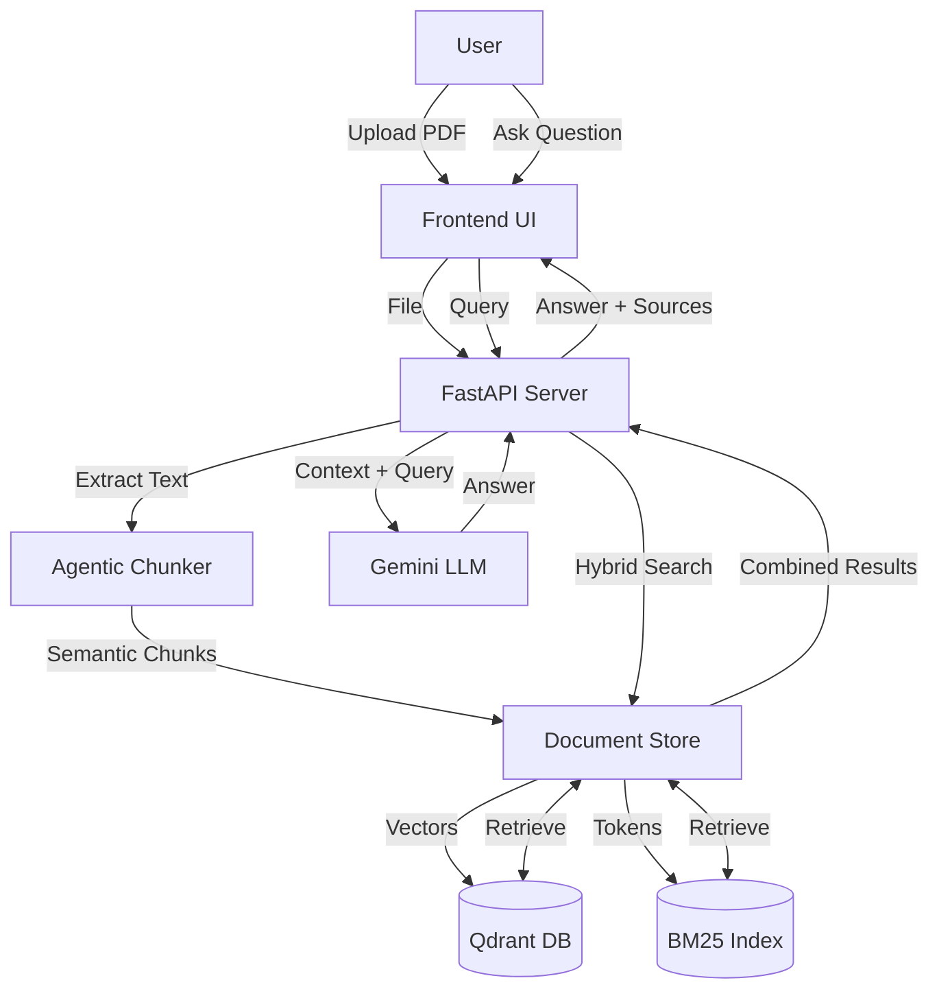

# System Design: Agentic RAG with Hybrid Search

## 1. Overview
This system is an Advanced RAG (Retrieval-Augmented Generation) application that uses a **Hybrid Search** approach combining Semantic Search (Vector) and Keyword Search (BM25) to retrieve the most relevant context for answering user queries. It features a custom **Semantic Chunking** strategy with merging logic to ensure high-quality context.

## 2. Architecture

### 2.1 Tech Stack
- **Backend Framework**: FastAPI
- **Vector Database**: Qdrant (Local file-based persistence)
- **LLM & Embeddings**: Google Gemini (`gemini-2.0-flash-exp`, `models/embedding-001`)
- **Orchestration**: LangChain
- **Keyword Search**: `rank_bm25` (In-memory index, rebuilt from Qdrant on startup)

### 2.2 Data Pipeline (Ingestion)
1.  **Upload**: Users upload PDF, TXT, or MD files via the UI.
2.  **Extraction**: Text is extracted from files (using `pypdf` for PDFs).
3.  **Chunking**:
    - **Base Split**: Recursive Character Splitter (size=1500, overlap=300).
    - **Semantic Refinement**: `SemanticChunker` (Percentile threshold: 90) breaks text at semantic boundaries.
    - **Merging Strategy**: Small chunks (< 350 chars) are merged with neighbors to prevent data fragmentation.
4.  **Indexing**:
    - **Vector Index**: Chunks are embedded and stored in Qdrant.
    - **Keyword Index**: Chunks are tokenized and added to the BM25 index.

### 2.3 Retrieval Pipeline (Hybrid Search)
1.  **Query Processing**: User query is received.
2.  **Parallel Search**:
    - **Semantic Search**: Query is embedded and searched against Qdrant (Top K).
    - **Keyword Search**: Query is tokenized and searched against BM25 index (Top K).
3.  **Result Combination**:
    - Results from both sources are combined.
    - Duplicates are removed.
    - Source type is labeled (`SEMANTIC`, `BM25`, or `HYBRID`).
4.  **Context Assembly**: Top unique results are selected as context.

### 2.4 Generation (RAG)
1.  **Prompting**: A detailed prompt is constructed with the retrieved context.
2.  **Synthesis**: Gemini LLM generates a comprehensive answer based on the context.
3.  **Response**: The answer and the full source chunks (with scores and metadata) are returned to the UI.

## 3. Key Components

### `backend/chunking.py`
- **`AgenticChunker`**: Implements the hybrid semantic chunking and merging logic.

### `backend/vector_store.py`
- **`DocumentStore`**: Manages both Qdrant and BM25 indexes.
- **`_load_bm25()`**: Rebuilds the BM25 index from Qdrant data on initialization to ensure persistence.
- **`hybrid_search()`**: Executes the combined search logic.

### `web/server.py`
- **FastAPI Server**: Handles file uploads, search requests, and RAG generation.
- **Endpoints**: `/upload`, `/search`, `/ask`, `/clear`, `/stats`.

### `web/index.html`
- **Frontend**: A clean, responsive UI for testing the RAG pipeline.
- **Features**: Drag-and-drop upload, real-time search, RAG chat interface, result visualization.

## 4. Data Flow

